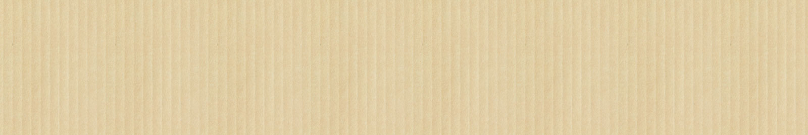

# Uppgift - återskapa Ekolådan

## Steg 1 - förberedelser - webbrot

* Skapa en mapp som heter **ekoladan**
* Skapa en webbsida som heter **kontakt.html**
* Skapa en CSS-fil som heter **kontakt.css**
* Skapa en mapp **bilder**

## Steg 2 - skapa HTML-sidan 

### Grundkoden

* Börja med grundkoden
* Fyll i alla HTML-element som bygger upp sidan
* Så här ett formulär ut: [https://devdocs.io/html/element/form](https://devdocs.io/html/element/form)

### Material

* Texter på sidan

> Du når oss på telefon 08-554 810 80. Våra telefontider är måndag-fredag mellan klockan 10 och 12 och på tisdagar även mellan 13 och 15. Vid andra tider är det säkraste sättet att komma i kontakt med oss att skicka ett meddelande till info@ekoladan.se eller genom att använda formuläret nedan.

> **Postadress:**  
> Stiftelsen Biodynamiska Produkter  
> Att: Ekolådan  
> Box 42  
> 153 21 Järna  
>   
> **Besöksadress:**  
> Tuna industriväg 17

* Bakgrundsbilden

## **Steg 3 - snygga till sidan med CSS** 

### CSS-reglerna 

* Infoga först CSS-reset
* Infoga alla CSS-regler som motsvarar de taggar vi använder
* **Välj typsnitt**
* Gå till [Google Fonts](https://fonts.google.com) och välj två typsnitt

