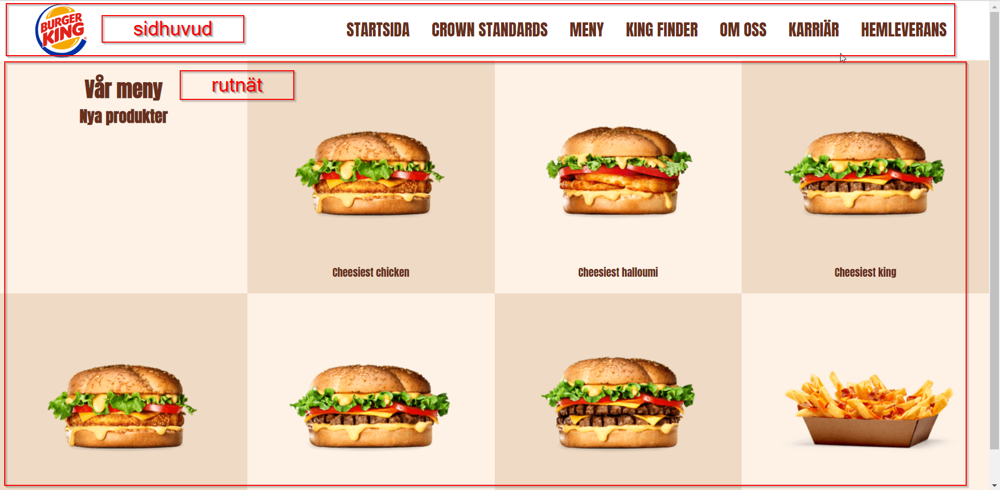

# Big Burger meny

## Resultat

## Genomgång



* Spel för att bli expert på CSS grid: [https://cssgridgarden.com/\#sv](https://cssgridgarden.com/#sv)

## Steg 1 - förberedelser - webbrot

* Skapa en mapp som heter **burger-king**
* Skapa en webbsida som heter **meny.html**
* Skapa en CSS-fil som heter **style.css**
* Skapa en mapp **bilder**

## Steg 2 - skapa HTML-sidan 

### Grundkoden

* Börja med grundkoden
* Fyll i alla HTML-element som bygger upp sidan
* Hämta material från [https://www.burgerking.se/menu](https://www.burgerking.se/menu)

## **Steg 3 - snygga till sidan med CSS** 

### CSS-reglerna 

* Infoga först CSS-reset
* Infoga alla CSS-regler som motsvarar de taggar vi använder
* Gå till [Google Fonts](https://fonts.google.com/) och välj liknande typsnitt

